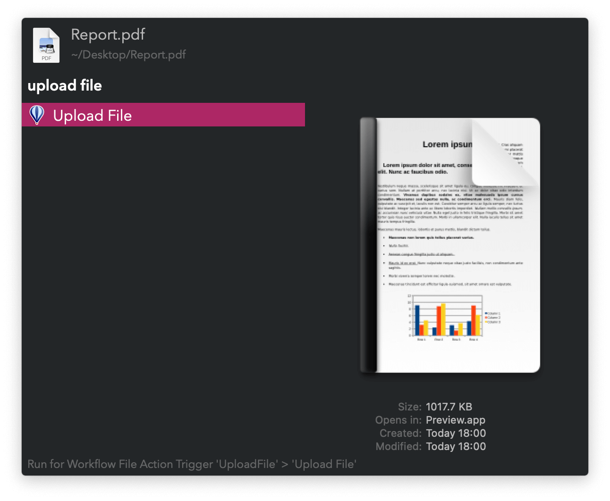

#  Upload File Alfred Workflow

Upload files and folders for easy sharing

[⤓ Install on the Alfred Gallery](https://alfred.app/workflows/vitor/upload-file)

## Usage

Upload files and folders via the [Universal Action](https://www.alfredapp.com/help/features/universal-actions/). Folders and multiple files will are zipped prior to upload.

When done, the download link is copied to the clipboard. Check upload progress via the `ufp` keyword.

* <kbd>⌘</kbd><kbd>↩&#xFE0E;</kbd> Cancel upload.
